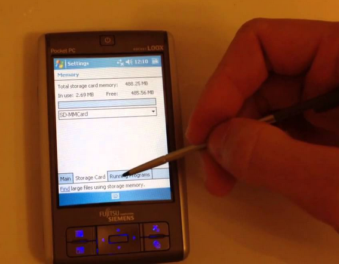

# Давным-давно...
В стародавние времена я хотел выучить английский и читал книжки на нем. 
А использовал для этого 

На нем был совершенно прекрасный workflow для чтения и запоминания слов: 

1. Читаешь книгу в читался, если не знаешь слово "тыкаешь в него палочкой" 
2. Окрывается словарь, где ты смотришь, что оно значит, а дальше еще раз "тыкнув палочкой" 
3. Слово добавляется в список для изучения. 
4. Наконец, когда есть время (особенно в метро, например) штудируешь эти слова, для этого было несколько мини-игр/упражнений. 

Итого, был именно простой workflow 

```
чтение - перевод незнакомых слов - добавление слова для заучивания - заучивание и повторение
```
Между каждым из этих пунктов был очень простой переход (буквально "тыкни палочкой" next-next-next)

Прошло время и захотел я настроить такой же workflow у себя на телефоне с последний андроидом, а... не выходит. 

Читалок - куча! Почти каждая вторая читалка предлагает посмотреть слово в словаре. Но не далее. 
Программы для ведения карточек и заучивания слов? Вроде есть anko, он даже знает про spaced repetition, но пользоваться им неудобно, обучение - тупо перелистываешь карточки, хотя в стародавние времена трава была зеленее, а программ обучения было больше. Есть словать со встроенным "обучением", но он ничего не знает о spaced repetition и работает только из под windows. Есть, наконец, 
системы, для изучения английского, чтением текстов - но они не дают так просто тебе читать любой твой текст... Короче


Я решил сделать свою программу для изучения слов, только с блэкджеком и шлюхами

Начнем с упражнений... Возмем за основу 3 упражнения


